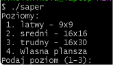
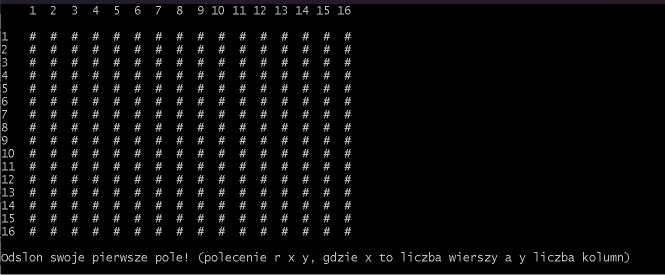
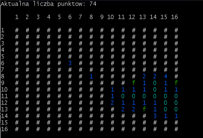
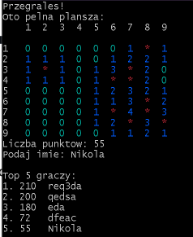

# Saper (Minesweeper) — C Console Game

A console implementation of the classic **Minesweeper** game, written in C, built with a `Makefile` and run via **MSYS2 MINGW64**.

> **🇵🇱 Language note:** This was a university project — the console interface and code comments are in Polish. Feature list and usage below are in English.

## Features

- Easy / medium / hard difficulty, plus a custom board (your own rows, columns, mine count)
- First move is always guaranteed safe — mines are placed only after it
- Recursive flood-fill reveal for empty cells, flagging/unflagging mines
- Colored board rendering
- Persistent high-score table (`wyniki.txt`) with a top-5 leaderboard
- A file-driven mode (`-f`) that loads a board + a sequence of moves from a file and replays them — handy for testing without playing interactively

## Build & Run

```bash
cd path_to_project_folder
make
./saper                    # interactive mode
./saper -f path_to_file    # replay a board + moves from a file
```

## How to Play

- `r <row> <col>` — reveal a cell
- `f <row> <col>` — place/remove a flag

The game ends when all mine-free cells are revealed (win) or a mine is triggered (loss). At the end you enter your name, your score is saved, and the top 5 scores are shown.

Example input file for `-f` mode:

```
1 2 1 1 1
1 * 2 2 *
2 3 4 * 2
1 * * 2 1
1 2 2 1 0
r 1 1
r 2 2
```

## Project Structure

| File | Responsibility |
|---|---|
| `sapermain.c` | Entry point, game loop, difficulty selection, `-f` flag parsing |
| `plansze.c` | Board generation, mine placement, adjacency counting, rendering |
| `polecenia.c` | Command parsing (`r`/`f`), recursive reveal logic |
| `top.c` | Reads/sorts/prints the high-score table |
| `funkcjaf.c` | Replays a board + moves loaded from a file (`-f` mode) |

## Screenshots

| Difficulty selection | First move | Mid-game | Game over |
|---|---|---|---|
|  |  |  |  |


